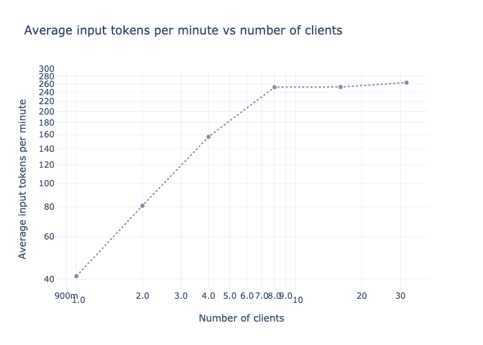
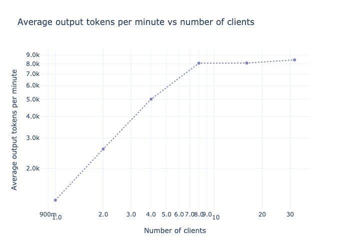
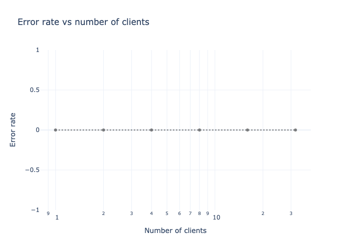
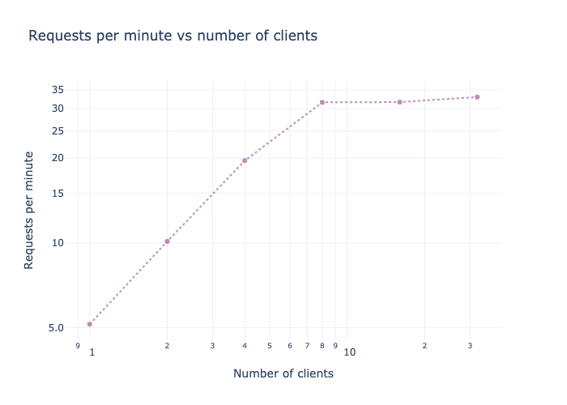
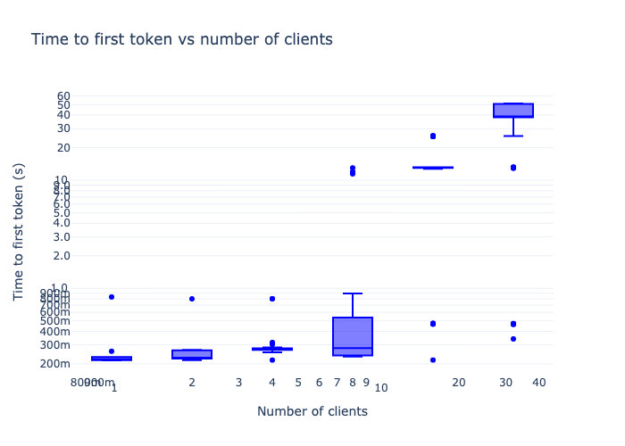
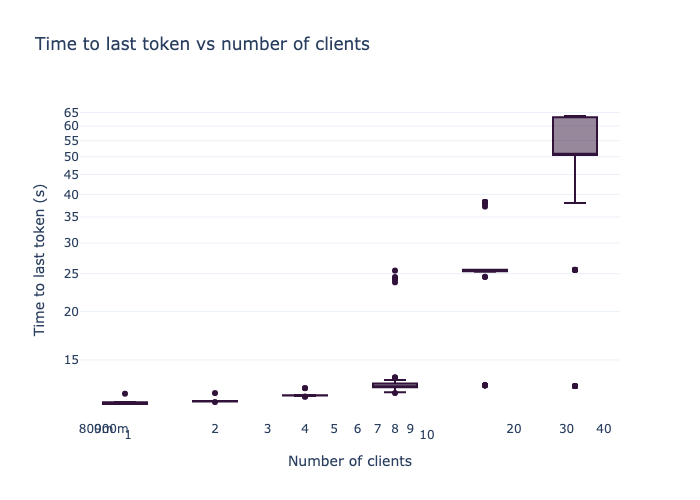
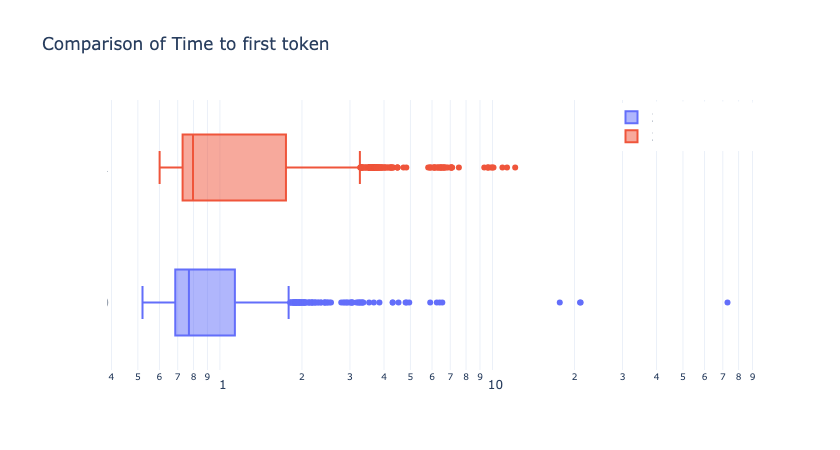
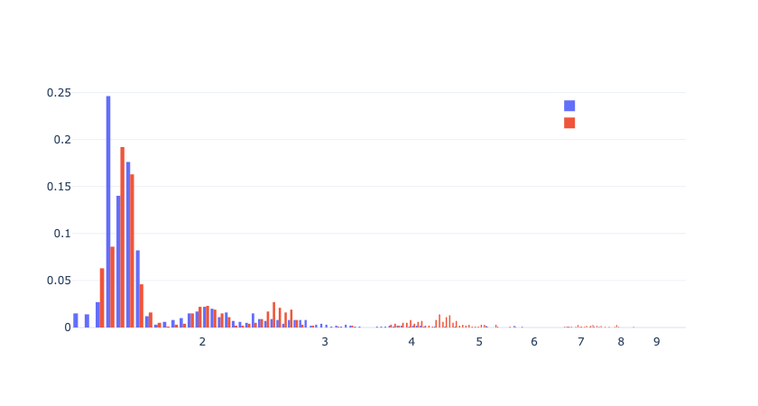

<div align="center">


**Measuring large language models latency and throughput**

[](https://pypi.python.org/pypi/llmeter)
[](https://pypi.python.org/pypi/llmeter)
[](https://github.com/astral-sh/ruff)

</div>

LLMeter is a pure-python library for simple latency and throughput testing of large language models (LLMs). It's designed to be lightweight to install; straightforward to run standard tests; and versatile to integrate - whether in notebooks, CI/CD, or other workflows.

## 🛠️ Installation

LLMeter requires `python>=3.10`, please make sure your current version of python is compatible.

To install the basic metering functionalities, you can install the minimum package using pip install:

```terminal
pip install llmeter
```

LLMeter also offers extra features that require additional dependencies. Currently these extras include:

- **plotting**: Add methods to generate charts to summarize the results
- **openai**: Enable testing endpoints offered by OpenAI
- **litellm**: Enable testing a range of different models through [LiteLLM](https://github.com/BerriAI/litellm)
- **mlflow**: Enable logging LLMeter experiments to [MLFlow](https://mlflow.org/)

You can install one or more of these extra options using pip:

```terminal
pip install 'llmeter[plotting,openai,litellm,mlflow]'
```

## 🚀 Quick-start

At a high level, you'll start by configuring an LLMeter "Endpoint" for whatever type of LLM you're connecting to:

```python
# For example with Amazon Bedrock...
from llmeter.endpoints import BedrockConverse
endpoint = BedrockConverse(model_id="...")

# ...or OpenAI...
from llmeter.endpoints import OpenAIEndpoint
endpoint = OpenAIEndpoint(model_id="...", api_key="...")

# ...or via LiteLLM...
from llmeter.endpoints import LiteLLM
endpoint = LiteLLM("{provider}/{model_id}")

# ...and so on
```

You can then run the high-level "experiments" offered by LLMeter:

```python
# Testing how throughput varies with concurrent request count:
from llmeter.experiments import LoadTest
load_test = LoadTest(
    endpoint=endpoint,
    payload={...},
    sequence_of_clients=[1, 5, 20, 50, 100, 500],
    output_path="local or S3 path"
)
load_test_results = await load_test.run()
load_test_results.plot_results()
```

Where `payload` can be a single dictionary, a list of dictionary, or a path to a JSON Line file that contains a payload for every line.

Alternatively, you can use the low-level `llmeter.runner.Runner` class to run and analyze request
batches - and build your own custom experiments.

```python
from llmeter.runner import Runner

endpoint_test = Runner(
    endpoint,
    tokenizer=tokenizer,
    output_path="local or S3 path",
)
result = await endpoint_test.run(
    payload={...},
    n_requests=3,
    clients=3,
)

print(result.stats)
```

Additional functionality like cost modelling and MLFlow experiment tracking is enabled through `llmeter.callbacks`, and you can write your own callbacks to hook other custom logic into LLMeter test runs.

For more details, check out our selection of end-to-end code examples in the [examples](https://github.com/awslabs/llmeter/tree/main/examples) folder!

## Analyze and compare results

You can analyze the results of a single run or a load test by generating interactive charts. You can find examples in in the [examples](examples) folder.

### Load testing

You can generate a collection of standard charts to visualize the result of a load test:

```python
# Load test results
from llmeter.experiments import LoadTestResult
load_test_result = LoadTestResult.load("local or S3 path", test_name="Test result")

figures = load_test_result.plot_results()
```

|   |   |
|---|---|
|   |   |
|---|---|
| | |

You can see how to compare two load test in [Compare load test](<examples/Compare load tests.ipynb>).

### Single Run visualizations

Metrics like _time to first token_ (TTFT) and _time per output token_ (TPOT) are described as distributions. While statistical descriptions of these distributions (median, 90th percentile, average, etc.) are a convenient way to compare them, visualizations provide insights on the endpoint behavior.

#### Boxplot

```python
import plotly.graph_objects as go
from llmeter.plotting import boxplot_by_dimension

result = Result.load("local or S3 path")

fig = go.Figure()
trace = boxplot_by_dimension(result=result, dimension="time_to_first_token")
fig.add_trace(trace)
```

Multiple traces can easily be combined into the same figure.



#### Histograms

```python
import plotly.graph_objects as go
from llmeter.plotting import histogram_by_dimension

result = Result.load("local or S3 path")

fig = go.Figure()
trace = histogram_by_dimension(result=result, dimension="time_to_first_token", xbins={"size":0.02})
fig.add_trace(trace)
```

Multiple traces can easily be combined into the same figure.



## Security

See [CONTRIBUTING](https://github.com/awslabs/llmeter/tree/main/CONTRIBUTING.md#security-issue-notifications) for more information.

## License

This project is licensed under the Apache-2.0 License.
