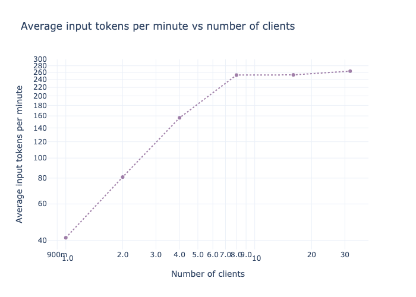
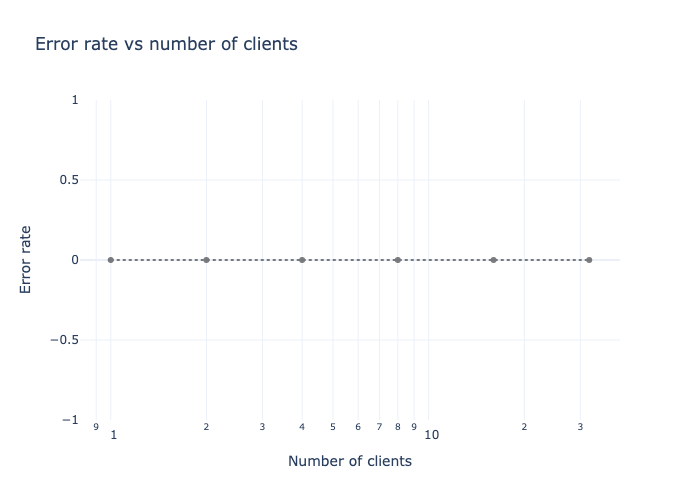
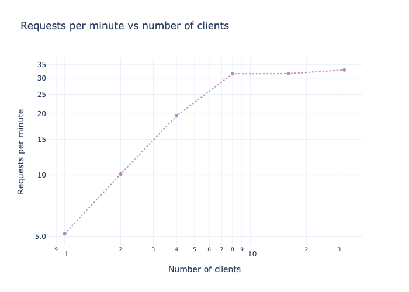
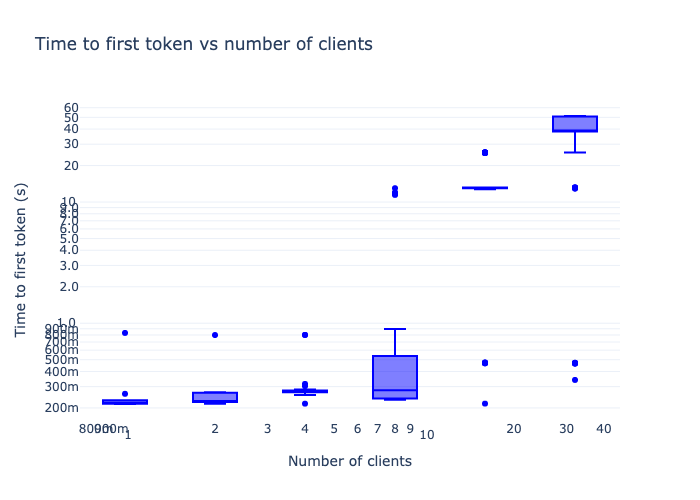
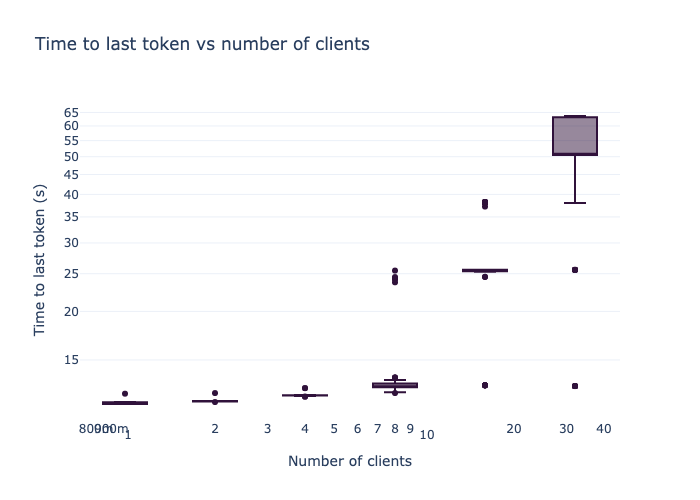
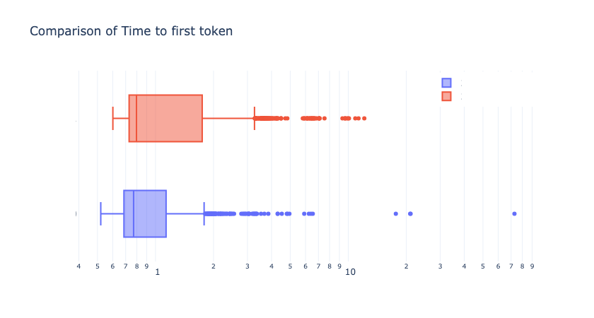
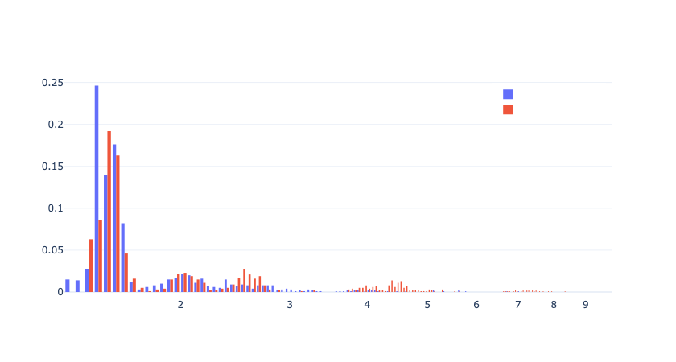

<div align="center">


**Measuring large language models latency and throughput**

[](https://pypi.python.org/pypi/llmeter)
[](https://pypi.python.org/pypi/llmeter)
[](https://github.com/astral-sh/ruff)

</div>

LLMeter is a pure-python library for simple latency and throughput testing of large language models (LLMs). It's designed to be lightweight to install; straightforward to run standard tests; and versatile to integrate - whether in notebooks, CI/CD, or other workflows.

## 🛠️ Installation

LLMeter requires `python>=3.10`, please make sure your current version of python is compatible.

To install the basic metering functionalities, you can install the minimum package using pip or uv:

```terminal
pip install llmeter
```

Or with uv (recommended for faster installation):

```terminal
uv pip install llmeter
```

LLMeter also offers extra features that require additional dependencies. Currently these extras include:

- **plotting**: Add methods to generate charts to summarize the results
- **openai**: Enable testing endpoints offered by OpenAI
- **litellm**: Enable testing a range of different models through [LiteLLM](https://github.com/BerriAI/litellm)
- **mlflow**: Enable logging LLMeter experiments to [MLFlow](https://mlflow.org/)

You can install one or more of these extra options using pip:

```terminal
pip install 'llmeter[plotting,openai,litellm,mlflow]'
```

Or with uv:

```terminal
uv pip install 'llmeter[plotting,openai,litellm,mlflow]'
```

## 🚀 Quick-start

At a high level, you'll start by configuring an LLMeter "Endpoint" for whatever type of LLM you're connecting to:

```python
# For example with Amazon Bedrock...
from llmeter.endpoints import BedrockConverse
endpoint = BedrockConverse(model_id="...")

# ...or OpenAI...
from llmeter.endpoints import OpenAIEndpoint
endpoint = OpenAIEndpoint(model_id="...", api_key="...")

# ...or via LiteLLM...
from llmeter.endpoints import LiteLLM
endpoint = LiteLLM("{provider}/{model_id}")

# ...and so on
```

You can then run the high-level "experiments" offered by LLMeter:

```python
# Testing how throughput varies with concurrent request count:
from llmeter.experiments import LoadTest
load_test = LoadTest(
    endpoint=endpoint,
    payload={...},
    sequence_of_clients=[1, 5, 20, 50, 100, 500],
    output_path="local or S3 path"
)
load_test_results = await load_test.run()
load_test_results.plot_results()
```

Where `payload` can be a single dictionary, a list of dictionary, or a path to a JSON Line file that contains a payload for every line.

Alternatively, you can use the low-level `llmeter.runner.Runner` class to run and analyze request
batches - and build your own custom experiments.

```python
from llmeter.runner import Runner

endpoint_test = Runner(
    endpoint,
    tokenizer=tokenizer,
    output_path="local or S3 path",
)
result = await endpoint_test.run(
    payload={...},
    n_requests=3,
    clients=3,
)

print(result.stats)
```

Additional functionality like cost modelling and MLFlow experiment tracking is enabled through `llmeter.callbacks`, and you can write your own callbacks to hook other custom logic into LLMeter test runs.

For more details, check out our selection of end-to-end code examples in the [examples](https://github.com/awslabs/llmeter/tree/main/examples) folder!

## 🖼️ Multi-Modal Payload Support

LLMeter supports creating payloads with multi-modal content including images, videos, audio, and documents alongside text. This enables testing of modern multi-modal AI models.

### Installation for Multi-Modal Support

For enhanced format detection from file content (recommended), install the optional `multimodal` extra:

```terminal
pip install 'llmeter[multimodal]'
```

Or with uv:

```terminal
uv pip install 'llmeter[multimodal]'
```

This installs the `puremagic` library for content-based format detection using magic bytes. Without it, format detection falls back to file extensions.

### Basic Multi-Modal Usage

```python
from llmeter.endpoints import BedrockConverse

# Single image from file
payload = BedrockConverse.create_payload(
    user_message="What is in this image?",
    images=["photo.jpg"],
    max_tokens=256
)

# Multiple images
payload = BedrockConverse.create_payload(
    user_message="Compare these images:",
    images=["image1.jpg", "image2.png"],
    max_tokens=512
)

# Image from bytes (requires puremagic for format detection)
with open("photo.jpg", "rb") as f:
    image_bytes = f.read()

payload = BedrockConverse.create_payload(
    user_message="What is in this image?",
    images=[image_bytes],
    max_tokens=256
)

# Mixed content types
payload = BedrockConverse.create_payload(
    user_message="Analyze this presentation and supporting materials",
    documents=["slides.pdf"],
    images=["chart.png"],
    max_tokens=1024
)

# Video analysis
payload = BedrockConverse.create_payload(
    user_message="Describe what happens in this video",
    videos=["clip.mp4"],
    max_tokens=1024
)
```

### Supported Content Types

- **Images**: JPEG, PNG, GIF, WebP
- **Documents**: PDF
- **Videos**: MP4, MOV, AVI
- **Audio**: MP3, WAV, OGG

Format support varies by model. The library detects formats automatically and lets the API endpoint validate compatibility.

### Endpoint-Specific Format Handling

Different endpoints expect different format strings:

- **Bedrock**: Uses short format strings (e.g., `"jpeg"`, `"png"`, `"pdf"`)
- **OpenAI**: Uses full MIME types (e.g., `"image/jpeg"`, `"image/png"`)
- **SageMaker**: Uses Bedrock format by default (model-dependent)

The library handles these differences automatically based on the endpoint you're using.

### ⚠️ Security Warning: Format Detection Is NOT Input Validation

**IMPORTANT**: The format detection in this library is for testing and development convenience ONLY. It is NOT a security mechanism and MUST NOT be used with untrusted files without proper validation.

#### What This Library Does

- Detects likely file format from magic bytes (puremagic) or extension (mimetypes)
- Reads binary content from files
- Packages content for API endpoints
- Provides type checking (bytes vs strings)

#### What This Library Does NOT Do

- ❌ Validate file content safety or integrity
- ❌ Scan for malicious content or malware
- ❌ Sanitize or clean file data
- ❌ Protect against malformed or exploited files
- ❌ Guarantee format correctness beyond detection heuristics
- ❌ Validate file size or prevent memory exhaustion
- ❌ Check for embedded scripts or exploits
- ❌ Verify file authenticity or source

#### Intended Use Cases

This format detection is designed for:

- **Testing and development**: Loading known-safe test files during development
- **Internal tools**: Processing files from trusted internal sources
- **Prototyping**: Quick experimentation with multi-modal models
- **Controlled environments**: Scenarios where file sources are fully trusted

#### NOT Intended For

This format detection should NOT be used for:

- **Production user uploads**: Files uploaded by end users through web forms or APIs
- **External file sources**: Files from untrusted URLs, email attachments, or third-party systems
- **Security-sensitive applications**: Any application where file safety is critical
- **Public-facing services**: Services that accept files from the internet

#### Recommended Security Practices for Untrusted Files

When working with untrusted files (user uploads, external sources, etc.), you MUST implement proper security measures:

1. **Validate file sources**: Only accept files from trusted, authenticated sources
2. **Scan for malware**: Use antivirus/malware scanning (e.g., ClamAV) before processing
3. **Validate file integrity**: Verify checksums, digital signatures, or other integrity mechanisms
4. **Sanitize content**: Use specialized libraries to validate and sanitize file content:
   - Images: Re-encode with PIL/Pillow to strip metadata and validate structure
   - PDFs: Use PDF sanitization libraries to remove scripts and validate structure
   - Videos: Re-encode with ffmpeg to validate and sanitize
5. **Limit file sizes**: Enforce maximum file size limits before reading into memory
6. **Sandbox processing**: Process untrusted files in isolated environments (containers, VMs)
7. **Validate API responses**: Check that API endpoints successfully processed the content
8. **Implement rate limiting**: Prevent abuse through excessive file uploads
9. **Log and monitor**: Track file processing for security auditing

### Backward Compatibility

Text-only payloads continue to work exactly as before:

```python
# Still works - no changes needed
payload = BedrockConverse.create_payload(
    user_message="Hello, world!",
    max_tokens=256
)
```

## Analyze and compare results

You can analyze the results of a single run or a load test by generating interactive charts. You can find examples in in the [examples](examples) folder.

### Load testing

You can generate a collection of standard charts to visualize the result of a load test:

```python
# Load test results
from llmeter.experiments import LoadTestResult
load_test_result = LoadTestResult.load("local or S3 path", test_name="Test result")

figures = load_test_result.plot_results()
```

|   |   |
|---|---|
|   |   |
|---|---|
| | |

You can see how to compare two load test in [Compare load test](<examples/Compare load tests.ipynb>).

### Single Run visualizations

Metrics like _time to first token_ (TTFT) and _time per output token_ (TPOT) are described as distributions. While statistical descriptions of these distributions (median, 90th percentile, average, etc.) are a convenient way to compare them, visualizations provide insights on the endpoint behavior.

#### Boxplot

```python
import plotly.graph_objects as go
from llmeter.plotting import boxplot_by_dimension

result = Result.load("local or S3 path")

fig = go.Figure()
trace = boxplot_by_dimension(result=result, dimension="time_to_first_token")
fig.add_trace(trace)
```

Multiple traces can easily be combined into the same figure.



#### Histograms

```python
import plotly.graph_objects as go
from llmeter.plotting import histogram_by_dimension

result = Result.load("local or S3 path")

fig = go.Figure()
trace = histogram_by_dimension(result=result, dimension="time_to_first_token", xbins={"size":0.02})
fig.add_trace(trace)
```

Multiple traces can easily be combined into the same figure.



## Security

See [CONTRIBUTING](https://github.com/awslabs/llmeter/tree/main/CONTRIBUTING.md#security-issue-notifications) for more information.

## License

This project is licensed under the Apache-2.0 License.
