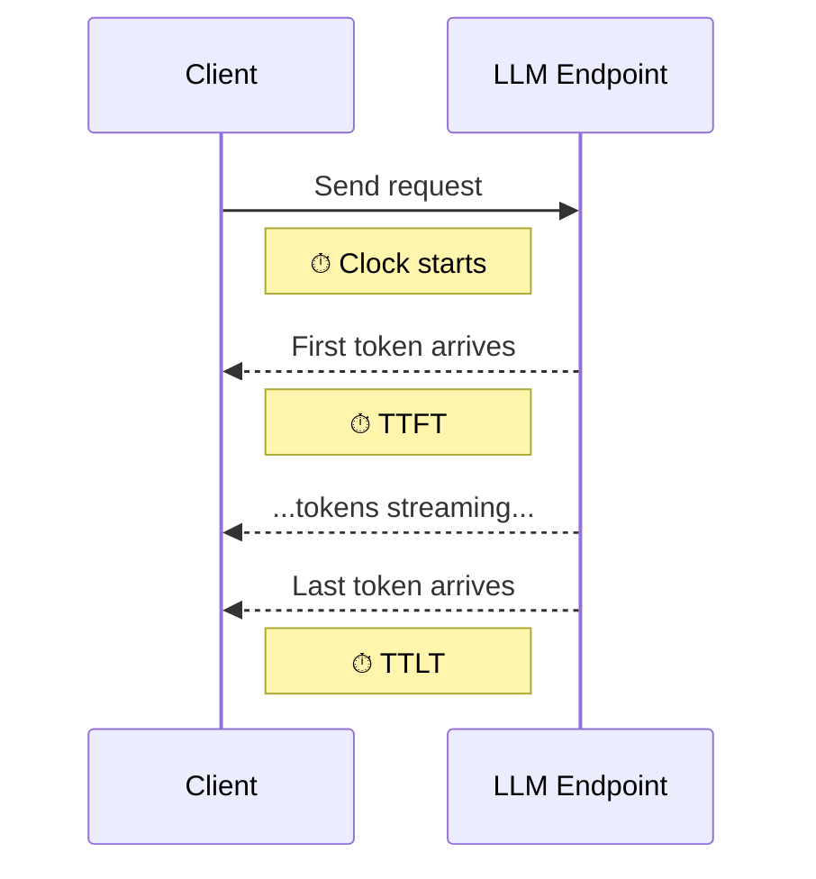

# Metrics and Statistics

## LLM latency metrics

When evaluating the performance of a large language model, latency is typically broken down into a few key metrics. These are general concepts, independent of any specific tool.



### Time to First Token (TTFT)

The time a consumer waits before receiving any response. For streaming endpoints, this is the delay before the first chunk arrives. TTFT is primarily influenced by the model's prefill phase (processing the input prompt) and network latency.

When comparing two endpoints, TTFT is most meaningful when the input token count is the same (or close enough that the difference is smaller than the precision you want to measure).

### Time to Last Token (TTLT)

The total end-to-end latency from sending the request to receiving the complete response. This is the metric most directly tied to user-perceived response time for non-streaming use cases.

### Time Per Output Token (TPOT)

The average generation speed per token, computed as:

```text
TPOT = (TTLT - TTFT) / (output_tokens - 1)
```

Ideally (excluding non-linear approaches like speculative decoding), TPOT should be a property of the underlying accelerated compute and largely independent of the number of input and generated tokens. This makes TPOT a useful metric for comparing endpoints even when the workloads differ.

### Streaming vs non-streaming

TTFT, TPOT, and the distinction from TTLT only apply to streaming endpoints. Non-streaming endpoints report only TTLT (the total round-trip time) since the entire response arrives at once.

!!! note
    TTLT may differ between streaming and non-streaming invocations of the same model, so always test the invocation method you'll actually be using. Don't choose to test streaming only because it provides additional metrics.

### Token counts

Input and output token counts are fundamental to understanding latency behavior. TTFT tends to scale with input length, while TTLT scales with output length. Token counts are also the primary cost driver for most pay-per-use LLM APIs.

### Why distributions matter

Latency metrics are best understood as distributions, not single numbers. While summary statistics (median, p90, average) are convenient for comparison, the underlying distribution reveals important behavior: bimodal patterns, long tails, or outliers that a single percentile would hide. Highly skewed data is common in LLM latency measurements.

### Percentiles and sample size

High percentiles (p90, p95, p99) are widely used to characterize tail latency, but their reliability depends directly on how many data points you have. A percentile estimate is only as good as the number of observations that actually fall in the tail beyond it.

The expected number of tail observations for a given percentile is `n × (1 - p)`:

| Percentile | Tail fraction | n for 1 tail observation | n for 5 tail observations |
| --- | --- | --- | --- |
| p90 | 10% | 10 | 50 |
| p95 | 5% | 20 | 100 |
| p99 | 1% | 100 | 500 |

With only 1 tail observation, the percentile estimate equals a single data point — any outlier (network glitch, cold start, GC pause) dominates the value. With 5 or more tail observations, the estimate is based on multiple independent measurements and becomes meaningfully stable.

As a practical guideline:

- Below `1 / (1 - p)` samples (e.g. fewer than 100 for p99), the percentile is purely extrapolated and should not be reported.
- Between `1 / (1 - p)` and `5 / (1 - p)` samples, the percentile exists but is unreliable — treat it as a rough approximation.
- Above `5 / (1 - p)` samples (e.g. 500+ for p99), the estimate is based on enough tail observations to be trustworthy for decision-making.

!!! tip "Sizing your test runs"
    When planning how many requests to include in a test run, consider which percentiles you need to report. If p99 latency is important for your SLOs, aim for at least 500 successful requests per run. For p90, 50 requests is a reasonable minimum.

This is not specific to LLM testing — it applies to any latency measurement. For further reading:

- [IBM Support: Why P99 Latency Metrics Are Unreliable for Low Traffic Workloads](https://www.ibm.com/support/pages/why-p99-latency-metrics-are-unreliable-low-traffic-workloads)
- [Penn State STAT 415: Distribution-Free Confidence Intervals for Percentiles](https://online.stat.psu.edu/stat415/book/export/html/835)
- [LinkedIn Engineering: Who Moved My 99th Percentile Latency?](https://engineering.linkedin.com/performance/who-moved-my-99th-percentile-latency)
- [Heinrich Hartmann: Latency SLOs Done Right](https://heinrichhartmann.com/blog/Latency-SLOs.html)

---

## How LLMeter captures these metrics

LLMeter measures all timings as wall-clock values from the client side using Python's `time.perf_counter`. They include network latency between LLMeter and the endpoint under test.

### Per-request fields

Each request produces an `InvocationResponse` with:

| Field | Unit | Description |
| --- | --- | --- |
| `response_text` | string | The generated text from the model. `None` on error. |
| `id` | string | A unique identifier for the invocation. Extracted from the API response when available (e.g. OpenAI response ID, AWS RequestId), otherwise auto-generated. |
| `time_to_first_token` | seconds | TTFT. Only populated for streaming endpoints. |
| `time_to_last_token` | seconds | TTLT. Always populated on successful requests. |
| `time_per_output_token` | seconds | TPOT. Only available when `num_tokens_output > 1`. |
| `num_tokens_input` | count | Input token count. Reported by the endpoint or estimated by a tokenizer configured on the `Runner`. |
| `num_tokens_output` | count | Output token count. Reported by the endpoint or estimated by a tokenizer configured on the `Runner`. |
| `num_tokens_input_cached` | count | Input tokens served from prompt cache. Reported by Bedrock (`cacheReadInputTokens`) and OpenAI (`cached_tokens`). `None` when caching is not active. |
| `input_payload` | dict | The full API request payload as sent to the provider (after `prepare_payload` processing). |
| `input_prompt` | string | The user-facing input text extracted from the payload, used for observability and as a token-counting fallback. |
| `error` | string | Error message if the request failed, `None` otherwise. Partial data (text, timing) may still be present alongside an error for streaming endpoints that fail mid-stream. |
| `retries` | count | Number of retries attempted by the underlying SDK. Reported by AWS endpoints (Bedrock, SageMaker) via `ResponseMetadata.RetryAttempts`. `None` for providers that don't expose this. |

### Run-level statistics

After a batch of requests completes, the `Runner` computes aggregate statistics available via `Result.stats`.

#### Throughput and error metrics

| Statistic | Description |
| --- | --- |
| `requests_per_minute` | Total requests divided by total test time, scaled to per-minute rate. |
| `failed_requests` | Count of requests that returned an error. |
| `failed_requests_rate` | Ratio of failed requests to total requests (0.0 to 1.0). |
| `total_input_tokens` | Sum of `num_tokens_input` across all requests. |
| `total_output_tokens` | Sum of `num_tokens_output` across all requests. |
| `total_cached_input_tokens` | Sum of `num_tokens_input_cached` across all requests. Only non-zero when prompt caching is active. |
| `average_input_tokens_per_minute` | Total input tokens divided by test time, scaled to per-minute rate. |
| `average_output_tokens_per_minute` | Total output tokens divided by test time, scaled to per-minute rate. |

#### Distribution statistics

For each of the five core per-request metrics (`time_to_last_token`, `time_to_first_token`, `num_tokens_output`, `num_tokens_input`, `num_tokens_input_cached`), LLMeter computes distributional aggregates across all successful responses. Each metric gets the following aggregations, accessible as `{metric}-{aggregation}` keys in `Result.stats`:

| Aggregation | Key suffix | Description |
| --- | --- | --- |
| Mean | `-average` | Arithmetic mean of all values. |
| Median (p50) | `-p50` | 50th percentile. |
| p90 | `-p90` | 90th percentile. |
| p99 | `-p99` | 99th percentile. |

For example, `Result.stats["time_to_first_token-p90"]` gives the 90th percentile TTFT across all requests in the run.

!!! tip
    `NaN` values (from failed requests) are automatically excluded from all aggregation calculations.

#### Accessing statistics

Statistics are available through the `Result.stats` property, or from the `stats.json` file saved in the output folder when an `output_path` is configured:

```python
result = await runner.run(payload=payload, n_requests=30, clients=5)

# Access stats programmatically
print(result.stats["time_to_first_token-p50"])
print(result.stats["requests_per_minute"])

# Or filter for a specific metric
ttft_stats = {k: v for k, v in result.stats.items() if "time_to_first_token" in k}
```

### Cost metrics

The `CostModel` callback extends `Result.stats` with cost estimates. When attached to a `Runner` or `Experiment`, it adds:

| Statistic | Description |
| --- | --- |
| `cost_total` | Total estimated cost for the entire run (all dimensions combined). |
| `cost_{DimensionName}` | Total cost for a specific dimension (e.g. `cost_InputTokens`, `cost_OutputTokens`). |
| `cost_per_request-average` | Mean cost per request (request-level dimensions only). |
| `cost_per_request-p50` | Median cost per request. |
| `cost_per_request-p90` | 90th percentile cost per request. |
| `cost_{DimensionName}_per_request-{aggregation}` | Per-dimension, per-request statistics. |

!!! warning
    When using a cost model with both request-level and run-level dimensions, `cost_per_request-average` only includes request-level costs. For the true average cost per request including infrastructure costs, use `result.cost_total / result.total_requests`.

See the [Model Costs example notebook](https://github.com/awslabs/llmeter/blob/main/examples/Model%20Costs.ipynb) for a walkthrough of request-based pricing, infrastructure-based pricing, and custom cost dimensions.

### Experiment-level metrics

#### Load test

The `LoadTest` experiment runs multiple batches at different concurrency levels (`sequence_of_clients`) and collects per-run statistics for each. This lets you observe how latency, throughput, and error rate change as concurrent request volume increases. The `LoadTestResult.plot_results()` method generates standard charts covering:

- Average input/output tokens vs. number of clients
- Error rate vs. number of clients
- Requests per minute vs. number of clients
- Time to first token vs. number of clients
- Time to last token vs. number of clients

#### Latency heatmap

The `LatencyHeatmap` experiment explores how latency varies as a function of input prompt length and output completion length, producing a 2D heatmap of response times.

### Visualizing distributions

LLMeter provides [Plotly](https://plotly.com/python/)-based plotting functions (requires the `plotting` extra):

```python
from llmeter.plotting import boxplot_by_dimension, histogram_by_dimension, scatter_histogram_2d
import plotly.graph_objects as go

# Boxplot comparison of TTFT across two runs
fig = go.Figure()
fig.add_traces([
    boxplot_by_dimension(result=result_1, dimension="time_to_first_token"),
    boxplot_by_dimension(result=result_2, dimension="time_to_first_token"),
])

# Histogram of TTFT with 20ms bins
fig = go.Figure()
fig.add_trace(
    histogram_by_dimension(result, dimension="time_to_first_token", xbins={"size": 0.02})
)

# 2D scatter + histogram of TPOT vs output token count
fig = scatter_histogram_2d(result, "num_tokens_output", "time_per_output_token", 20, 20)
```

For complete comparison workflows, see the example notebooks:

- [TTFT comparison](https://github.com/awslabs/llmeter/blob/main/examples/TTFT_comparison.ipynb) — comparing time to first token distributions with bootstrapped confidence intervals
- [TPOT comparison](https://github.com/awslabs/llmeter/blob/main/examples/TPOT_comparison.ipynb) — comparing time per output token, including TPOT vs. output length analysis
- [Compare load tests](https://github.com/awslabs/llmeter/blob/main/examples/Compare%20load%20tests.ipynb) — overlaying load test results side by side
