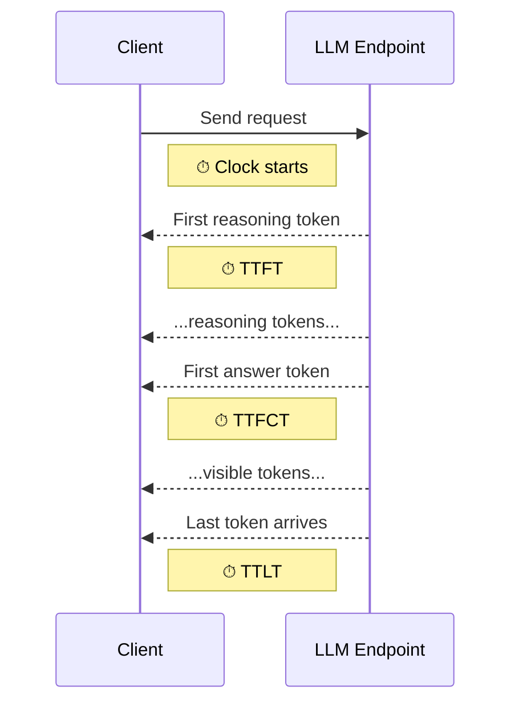

# Metrics and Statistics

## LLM latency metrics

When evaluating the performance of a large language model, latency is typically broken down into a few key metrics. These are general concepts, independent of any specific tool.


```mermaid
sequenceDiagram
    participant Client
    participant LLM as LLM Endpoint

    Client->>LLM: Send request
    Note right of Client: ⏱ Clock starts
    LLM-->>Client: First reasoning token
    Note right of Client: ⏱ TTFT
    LLM-->>Client: ...reasoning tokens...
    LLM-->>Client: First answer token
    Note right of Client: ⏱ TTFCT
    LLM-->>Client: ...visible tokens...
    LLM-->>Client: Last token arrives
    Note right of Client: ⏱ TTLT
```

### Time to First Token (TTFT)

The delay before the model produces its first output (either content or reasoning) token. TTFT is only measurable for streaming requests, and is primarily influenced by:

- The model's prefill phase (processing the input prompt)
- Any queueing at the endpoint, and
- Network latency

Since it includes the time taken to process your input prompt, comparing TTFT between models/endpoints is most meaningful when the input prompts are the same (or at least very close in length), and reasoning time is excluded.

!!! warning "Important differences between reasoning models"
    For models that generate reasoning or "thinking" before their final answer but **don't expose** this raw reasoning to clients in the response stream, TTFT will also include reasoning time - and therefore vary depending on both your configured reasoning effort and the amount of thinking required for each input prompt: Making it less useful as a comparison metric.

    Some models expose thinking only indirectly - summarized or redacted instead of raw. Anthropic Claude 4 and later return *summarized* thinking, while Claude 3.7 Sonnet returns original thinking but occasionally redacts parts of it. Other models emit only the reasoning token count. LLMeter tracks the reasoning
    disclosure level on [`InvocationResponse.reasoning_type`][llmeter.endpoints.base.InvocationResponse], and users should:

    1. Ensure your LLMeter Endpoints are configured to correctly declare the reasoning type where it cannot be detected from the response, and
    2. Consider TTFT as including all of the reasoning time when `reasoning_type` is `redacted`
       (which covers Anthropic's `thinking.display: "omitted"`), and at least some fraction of it
       when `summary` or `unknown`.

### Time to First Content Token (TTFCT)

For a reasoning (or "thinking") model, the first tokens the endpoint generates are internal reasoning tokens, which are not part of the final answer and may not be visible to users depending on your overall application's design.

As a result, both metrics are potentially interesting and LLMeter reports both:

- **TTFT** comes as close as possible to isolating prefill, queueing, and network cost, so it stays more comparable across models and across reasoning budgets. It's the number to use when benchmarking serving infrastructure.
- **TTFCT** is how long a user waits before starting to receive finalized output:
    - It's always equal to or longer than TTFT, because it includes the reasoning phase too
    - It's a better measure for user experience in cases where responses are streamed but users only see (or care about) the answer - not the model's internal thinking.
    - It's *not* usefully comparable between serving providers, unless the same prompts and reasoning configurations are being used and tests are averaging over multiple attempts.

### Time to Last Token (TTLT)

The total end-to-end latency from sending the request to receiving the complete response. This is the metric most directly tied to user-perceived response time for non-streaming use cases.

### Time Per Output Token (TPOT)

The average generation speed per output token, **after** output starts.

TPOT excludes the initial waiting period to give a measure of output speed that's roughly comparable even across different input prompt lengths, request queue times, or final output lengths: Answering the question "Once the model starts generating, how fast is it?".

For models that directly expose their reasoning stream, or go straight to answer generation without reasoning at all, LLMeter calculates this as:

```text
TPOT = (TTLT - TTFT) / (output_tokens - 1)
```

Some models do reason but **don't output the raw reasoning stream** - either redacting it (like Claude Sonnet 3.7), providing only a summary (like Claude 4+ with `thinking.display="summary"`), or omitting it altogether (default for Claude 4+). This would skew the TPOT calculation above because the observed time window no longer aligns with the total number of output tokens being generated. The inferred reasoning visibility for each response is stored on [`InvocationResponse.reasoning_type`][llmeter.endpoints.base.InvocationResponse].

Where possible in these cases, LLMeter will instead calculate TPOT based only on the answer content - excluding reasoning:

```text
TPOT = (TTLT - TTFCT) / (visible_output_tokens - 1)
```

This *only* works for endpoints that report the breakdown of total output token count by reasoning versus content, and assumes that all reasoning happens before the first content token output (not interleaved).


!!! warning "Check your Endpoint's reasoning configurations"
    Usefully-comparable TPOT and TTFT measurements depend on accurate and consistent treatment of reasoning/thinking. Some APIs (such as OpenAI Responses) make it structurally explicit in the response whether reasoning output is verbatim or summarized... But others (including Anthropic Messages, Bedrock Converse, and OpenAI Chat Completions) are ambiguous. Intermediate gateway layers can also change or mask provider behaviour.

    - **Request** reasoning output, if it's disabled by default on your target model, for more usefully-comparable TTFT statistics.
    - **Check** your target LLMeter Endpoint class for configuration parameters like `default_reasoning_visibility` controlling whether output reasoning is treated as verbatim, summarized, or something else.
    - **Validate** that the populated [`InvocationResponse.reasoning_type`][llmeter.endpoints.base.InvocationResponse] field in your responses is consistent with your model's actual reasoning streaming behaviour.

For models that don't share either the raw reasoning stream or the breakdown of reasoning versus answer token count, or other cases where the required data points aren't available, `time_per_output_token` is left unset rather than giving a faulty approximation.

### Streaming vs non-streaming

TTFT, TTFCT, TPOT, and the distinction from TTLT only apply to streaming endpoints. Non-streaming endpoints report only TTLT (the total round-trip time) since the entire response arrives at once.

!!! note
    TTLT may differ between streaming and non-streaming invocations of the same model, so always test the invocation method you'll actually be using. Don't choose to test streaming only because it provides additional metrics.

### Token counts

Input and output token counts are fundamental to understanding latency behavior. TTFT tends to scale with input length, while TTLT scales with output length. Token counts are also the primary cost driver for most pay-per-use LLM APIs.

For reasoning models, `num_tokens_output` is the provider-reported total and **includes** reasoning tokens, since that is what you are billed for. Where the provider breaks the figure down, the reasoning portion is also reported separately as `num_tokens_output_reasoning`.

!!! note
    Anthropic computes `thinking_tokens` by re-tokenizing the raw reasoning text, so it can differ from the model's exact generation count by a few tokens, and it reflects the *raw* reasoning rather than the possibly-shorter summarized thinking returned in the response body. Visible-token counts derived from it — and hence the fallback TPOT — are close approximations rather than exact figures.

### Why distributions matter

Latency metrics are best understood as distributions, not single numbers. While summary statistics (median, p90, average) are convenient for comparison, the underlying distribution reveals important behavior: bimodal patterns, long tails, or outliers that a single percentile would hide. Highly skewed data is common in LLM latency measurements.

### Percentiles and sample size

High percentiles (p90, p95, p99) are widely used to characterize tail latency, but their reliability depends directly on how many data points you have. A percentile estimate is only as good as the number of observations that actually fall in the tail beyond it.

The expected number of tail observations for a given percentile is `n × (1 - p)`:

| Percentile | Tail fraction | n for 1 tail observation | n for 5 tail observations |
| --- | --- | --- | --- |
| p90 | 10% | 10 | 50 |
| p95 | 5% | 20 | 100 |
| p99 | 1% | 100 | 500 |

With only 1 tail observation, the percentile estimate equals a single data point — any outlier (network glitch, cold start, GC pause) dominates the value. With 5 or more tail observations, the estimate is based on multiple independent measurements and becomes meaningfully stable.

As a practical guideline:

- Below `1 / (1 - p)` samples (e.g. fewer than 100 for p99), the percentile is purely extrapolated and should not be reported.
- Between `1 / (1 - p)` and `5 / (1 - p)` samples, the percentile exists but is unreliable — treat it as a rough approximation.
- Above `5 / (1 - p)` samples (e.g. 500+ for p99), the estimate is based on enough tail observations to be trustworthy for decision-making.

!!! tip "Sizing your test runs"
    When planning how many requests to include in a test run, consider which percentiles you need to report. If p99 latency is important for your SLOs, aim for at least 500 successful requests per run. For p90, 50 requests is a reasonable minimum.

This is not specific to LLM testing — it applies to any latency measurement. For further reading:

- [IBM Support: Why P99 Latency Metrics Are Unreliable for Low Traffic Workloads](https://www.ibm.com/support/pages/why-p99-latency-metrics-are-unreliable-low-traffic-workloads)
- [Penn State STAT 415: Distribution-Free Confidence Intervals for Percentiles](https://online.stat.psu.edu/stat415/book/export/html/835)
- [LinkedIn Engineering: Who Moved My 99th Percentile Latency?](https://engineering.linkedin.com/performance/who-moved-my-99th-percentile-latency)
- [Heinrich Hartmann: Latency SLOs Done Right](https://heinrichhartmann.com/blog/Latency-SLOs.html)

---

## How LLMeter captures these metrics

LLMeter measures all timings as wall-clock values from the client side using Python's `time.perf_counter`. They include network latency between LLMeter and the endpoint under test.

### Per-request fields

Each request produces an `InvocationResponse` with:

| Field | Unit | Description |
| --- | --- | --- |
| `response_text` | string | The generated text from the model. `None` on error. |
| `id` | string | A unique identifier for the invocation. Extracted from the API response when available (e.g. OpenAI response ID, AWS RequestId), otherwise auto-generated. |
| `time_to_first_token` | seconds | TTFT — first output token of any kind, reasoning included. Only populated for streaming endpoints. |
| `time_to_first_content_token` | seconds | TTFCT — first answer (non-reasoning) token. Only populated for streaming endpoints. Equal to `time_to_first_token` when the model emits no reasoning tokens. |
| `time_to_last_token` | seconds | TTLT. Always populated on successful requests. |
| `time_per_output_token` | seconds | TPOT. Requires more than one output token, and a consistent time/token pairing (see [TPOT](#time-per-output-token-tpot)). |
| `num_tokens_input` | count | Input token count. Reported by the endpoint or estimated by a tokenizer configured on the `Runner`. |
| `num_tokens_output` | count | Output token count, **including** reasoning tokens. Reported by the endpoint or estimated by a tokenizer configured on the `Runner`. |
| `num_tokens_input_cached` | count | Input tokens served from prompt cache. Reported by Bedrock (`cacheReadInputTokens`), OpenAI and LiteLLM (`prompt_tokens_details.cached_tokens`). `None` when the endpoint doesn't report a cache breakdown. |
| `num_tokens_output_reasoning` | count | The reasoning portion of `num_tokens_output`. Populated where the provider breaks it out (e.g. OpenAI `reasoning_tokens`, Anthropic `thinking_tokens`); `None` otherwise. |
| `reasoning_type` | string | How the model's reasoning was disclosed: `"verbatim"`, `"summary"`, `"redacted"`, `"unknown"`, or `None` (no reasoning observed). Resolved from the response content where possible, and otherwise from a positive `num_tokens_output_reasoning`, which yields `"unknown"`. See [`ReasoningType`][llmeter.endpoints.base.ReasoningType]. |
| `input_payload` | dict | The full API request payload as sent to the provider (after `prepare_payload` processing). |
| `input_prompt` | string | The user-facing input text extracted from the payload, used for observability and as a token-counting fallback. |
| `error` | string | Error message if the request failed, `None` otherwise. Partial data (text, timing) may still be present alongside an error for streaming endpoints that fail mid-stream. |
| `retries` | count | Number of retries attempted by the underlying SDK. Reported by AWS endpoints (Bedrock, SageMaker) via `ResponseMetadata.RetryAttempts`. `None` for providers that don't expose this. |

### Run-level statistics

After a batch of requests completes, the `Runner` computes aggregate statistics available via `Result.stats`.

#### Throughput and error metrics

| Statistic | Description |
| --- | --- |
| `requests_per_minute` | Total requests divided by total test time, scaled to per-minute rate. |
| `failed_requests` | Count of requests that returned an error. |
| `failed_requests_rate` | Ratio of failed requests to total requests (0.0 to 1.0). |
| `total_input_tokens` | Sum of `num_tokens_input` across all requests. |
| `total_output_tokens` | Sum of `num_tokens_output` across all requests. |
| `total_cached_input_tokens` | Sum of `num_tokens_input_cached` across all requests. Only non-zero when prompt caching is active. |
| `total_reasoning_output_tokens` | Sum of `num_tokens_output_reasoning` across all requests. Only non-zero for reasoning models on providers that report the breakdown. |
| `average_input_tokens_per_minute` | Total input tokens divided by test time, scaled to per-minute rate. |
| `average_output_tokens_per_minute` | Total output tokens divided by test time, scaled to per-minute rate. |

#### Distribution statistics

For each of the six core per-request metrics (`time_to_last_token`, `time_to_first_token`, `time_to_first_content_token`, `num_tokens_output`, `num_tokens_input`, `num_tokens_input_cached`), LLMeter computes distributional aggregates across all successful responses. Each metric gets the following aggregations, accessible as `{metric}-{aggregation}` keys in `Result.stats`:

| Aggregation | Key suffix | Description |
| --- | --- | --- |
| Mean | `-average` | Arithmetic mean of all values. |
| Median (p50) | `-p50` | 50th percentile. |
| p90 | `-p90` | 90th percentile. |
| p99 | `-p99` | 99th percentile. |

For example, `Result.stats["time_to_first_token-p90"]` gives the 90th percentile TTFT across all requests in the run.

!!! tip
    `NaN` values (from failed requests) are automatically excluded from all aggregation calculations. Metrics that are `None` for a given request (for example `time_to_first_token` on a non-streaming endpoint) are excluded too, so a metric that is never populated simply has no aggregation keys.

When working with a `Result` that has the responses loaded into memory, you can also calculate summary stats for any other numeric field on `InvocationResponse` yourself:

```python
from llmeter.utils import summary_stats_from_list

# Note: call `result.load_responses()` first, if responses not already in memory

tpots = [v for v in result.get_dimension("time_per_output_token") if v is not None]
print(summary_stats_from_list(tpots))  # {'average': ..., 'p50': ..., 'p90': ..., 'p99': ...}
```

#### Accessing statistics

Statistics are available through the `Result.stats` property, or from the `stats.json` file saved in the output folder when an `output_path` is configured:

```python
result = await runner.run(payload=payload, n_requests=30, clients=5)

# Access stats programmatically
print(result.stats["time_to_first_token-p50"])
print(result.stats["requests_per_minute"])

# Or filter for a specific metric
ttft_stats = {k: v for k, v in result.stats.items() if "time_to_first_token" in k}
```

### Cost metrics

The `CostModel` callback extends `Result.stats` with cost estimates. When attached to a `Runner` or `Experiment`, it adds:

| Statistic | Description |
| --- | --- |
| `cost_total` | Total estimated cost for the entire run (all dimensions combined). |
| `cost_{DimensionName}` | Total cost for a specific dimension (e.g. `cost_InputTokens`, `cost_OutputTokens`). |
| `cost_per_request-average` | Mean cost per request (request-level dimensions only). |
| `cost_per_request-p50` | Median cost per request. |
| `cost_per_request-p90` | 90th percentile cost per request. |
| `cost_{DimensionName}_per_request-{aggregation}` | Per-dimension, per-request statistics. |

!!! warning
    When using a cost model with both request-level and run-level dimensions, `cost_per_request-average` only includes request-level costs. For the true average cost per request including infrastructure costs, use `result.cost_total / result.total_requests`.

See the [Model Costs example notebook](https://github.com/awslabs/llmeter/blob/main/examples/Model%20Costs.ipynb) for a walkthrough of request-based pricing, infrastructure-based pricing, and custom cost dimensions.

### Experiment-level metrics

#### Load test

The `LoadTest` experiment runs multiple batches at different concurrency levels (`sequence_of_clients`) and collects per-run statistics for each. This lets you observe how latency, throughput, and error rate change as concurrent request volume increases. The `LoadTestResult.plot_results()` method generates standard charts covering:

- Average input/output tokens vs. number of clients
- Error rate vs. number of clients
- Requests per minute vs. number of clients
- Time to first token vs. number of clients
- Time to last token vs. number of clients

#### Latency heatmap

The `LatencyHeatmap` experiment explores how latency varies as a function of input prompt length and output completion length, producing a 2D heatmap of response times.

### Visualizing distributions

LLMeter provides [Plotly](https://plotly.com/python/)-based plotting functions (requires the `plotting` extra):

```python
from llmeter.plotting import boxplot_by_dimension, histogram_by_dimension, scatter_histogram_2d
import plotly.graph_objects as go

# Boxplot comparison of TTFT across two runs
fig = go.Figure()
fig.add_traces([
    boxplot_by_dimension(result=result_1, dimension="time_to_first_token"),
    boxplot_by_dimension(result=result_2, dimension="time_to_first_token"),
])

# Histogram of TTFT with 20ms bins
fig = go.Figure()
fig.add_trace(
    histogram_by_dimension(result, dimension="time_to_first_token", xbins={"size": 0.02})
)

# 2D scatter + histogram of TPOT vs output token count
fig = scatter_histogram_2d(result, "num_tokens_output", "time_per_output_token", 20, 20)
```

For complete comparison workflows, see the example notebooks:

- [TTFT comparison](https://github.com/awslabs/llmeter/blob/main/examples/TTFT_comparison.ipynb) — comparing time to first token distributions with bootstrapped confidence intervals
- [TPOT comparison](https://github.com/awslabs/llmeter/blob/main/examples/TPOT_comparison.ipynb) — comparing time per output token, including TPOT vs. output length analysis
- [Compare load tests](https://github.com/awslabs/llmeter/blob/main/examples/Compare%20load%20tests.ipynb) — overlaying load test results side by side
