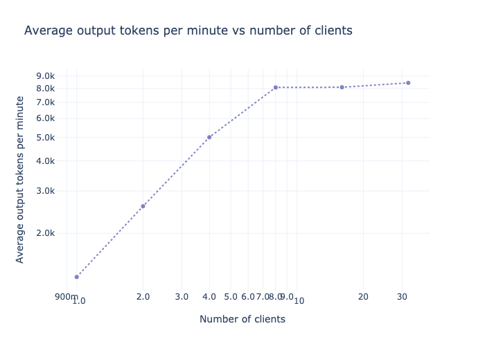

# Run Experiments

!!! tip "Learn by example"
    Check out the [LLMeter example notebooks](https://github.com/awslabs/llmeter/tree/main/examples) on GitHub for a range of end-to-end worked examples.

## Basic test "Runs"

Create and `.run(...)` a [Runner](../reference/runner.md#llmeter.runner.Runner) to make a batch of inference requests through your LLM `Endpoint` and calculate summary statistics on the results.

```python
from llmeter.runner import Runner

endpoint_test = Runner(
    endpoint,
    output_path=f"outputs/{endpoint.model_id}",
)
results = await endpoint_test.run(payload=sample_payload, n_requests=3, clients=5)
```

A Run spins up `clients` parallel clients, each of which loops through sending `n_requests` requests to your target endpoint, one after the other. This means that:

- The total number of requests sent in your Run will be `clients` ⨉ `n_requests`
- Your Run will continue until all the requests are complete (or errored out). If your LLM endpoint had infinite capacity and always took the same amount of time to respond, the Run duration would scale with `n_requests` and be independent of the number of parallel `clients`.
- Metrics like Run duration and requests per minute are **results** of the run, rather than directly configured.
- Towards the end of long Runs, concurrency may be much lower if most of the clients have already completed.

You can **re-use** Runners, and will find Run-specific subfolders are automatically created under your provided `output_path`. If you don't pass the optional `run_name` argument, runs will be named based on the current date & time.

```python
run_1_results = await endpoint_test.run(payload=sample_payload, n_requests=3, clients=5)
run_2_results = await endpoint_test.run(payload=sample_payload, n_requests=10, clients=10)

# Both will be subfolders under outputs/{endpoint.model_id} from above:
assert run_1_results.output_path != run_2_results.output_path
```

### Time-bound runs

By default, a Run sends a fixed number of requests per client (`n_requests`). Alternatively, you can use `run_duration` to run each client for a fixed number of **seconds** instead — useful when you want to measure sustained throughput over a time window rather than a fixed batch size.

```python
# Run for 60 seconds with 10 concurrent clients:
results = await endpoint_test.run(
    payload=sample_payload,
    run_duration=60,
    clients=10,
)

results.total_requests  # actual number of requests completed
results.stats["requests_per_minute"]  # observed throughput
```

`n_requests` and `run_duration` are mutually exclusive — set one or the other, not both.

During a time-bound run, the progress bar shows two lines: a time bar that fills as seconds elapse, and a request counter with live statistics (requests per minute, latency percentiles, tokens per second, etc.).

### Live progress-bar statistics

Both count-bound and time-bound runs display live statistics on the progress bar as requests complete. By default these include p50/p90 TTFT and TTLT, median output tokens per second, total input/output tokens, requests per minute, and failure count.

You can customize which stats are shown via the `progress_bar_stats` parameter:

```python
# Show only p99 latency, tokens/s, and rpm:
results = await endpoint_test.run(
    payload=sample_payload,
    n_requests=100,
    clients=5,
    progress_bar_stats={
        "rpm": "requests_per_minute",
        "p99_ttlt": ("time_to_last_token", "p99"),
        "tps": ("time_per_output_token", "p50", "inv"),
        "fail": "failed",
    },
)
```

Pass `progress_bar_stats={}` to disable live stats entirely. See [`DEFAULT_DISPLAY_STATS`](../reference/live_display.md) for the full default configuration.

### Low-memory mode

For large-scale runs where keeping all responses in memory is impractical, set `low_memory=True`. Responses are written to disk as they arrive but not accumulated in memory. Statistics are computed incrementally and available immediately via `result.stats`.

```python
results = await endpoint_test.run(
    payload=sample_payload,
    run_duration=300,
    clients=50,
    output_path="outputs/large_run",
    low_memory=True,
)

results.stats          # works — computed incrementally during the run
results.responses      # [] — not in memory
results.load_responses()  # loads from disk on demand
```

`low_memory=True` requires `output_path` to be set.

## Analyzing Run results

The [Result](../reference/results.md#llmeter.results.Result) of a Run provides basic metadata, a wide range of pre-computed `.stats`, and also access to the individual `.responses` ([InvocationResponse](../reference/endpoints/base/#llmeter.endpoints.base.InvocationResponse) objects).

printing a Result will give you a handy JSON summary which includes a lot of this information. For example:

```python
print(results)
```

```
{
    "total_requests": 5000,
    "clients": 50,
    "n_requests": 100,
    "total_test_time": 1044.951942336018,
    "model_id": "my-cool-model",
    "output_path": "outputs/my-cool-model/20260325-1336",
    "endpoint_name": "my-cool-model-endpoint",
    "provider": "openai",
    "run_name": "20260325-1336",
    "run_description": null,
    "start_time": "2026-03-25T13:36:53Z",
    "end_time": "2026-03-25T13:54:18Z",
    "failed_requests": 25,
    "failed_requests_rate": 0.005,
    "requests_per_minute": 287.09454267278744,
    "total_input_tokens": 3360101,
    "total_output_tokens": 1272354,
    "average_input_tokens_per_minute": 192933.33198587512,
    "average_output_tokens_per_minute": 73057.17794957834,
    "time_to_last_token-average": 6.645525417210839,
    "time_to_last_token-p50": 5.731963894009823,
    "time_to_last_token-p90": 6.823606405791361,
    "time_to_last_token-p99": 25.992216924043603,
    "time_to_first_token-average": 1.029764077696831,
    "time_to_first_token-p50": 0.6090650199912488,
    "time_to_first_token-p90": 1.026935306203086,
    "time_to_first_token-p99": 14.661495066354982,
    "num_tokens_output-average": 255.74954773869348,
    "num_tokens_output-p50": 256,
    "num_tokens_output-p90": 256.0,
    "num_tokens_output-p99": 256.0,
    "num_tokens_input-average": 675.3971859296482,
    "num_tokens_input-p50": 676,
    "num_tokens_input-p90": 677.0,
    "num_tokens_input-p99": 679.0
}
```

### Custom statistics

The [`Result.get_dimension`](../reference/results/#llmeter.results.Result.get_dimension) method provides a handy alternative to iterating over `Result.responses`, and the [`utils.summary_stats_from_list`](../reference/utils/#llmeter.utils.summary_stats_from_list) method can help with calculating custom quantiles, if you want:

```python
from llmeter.utils import summary_stats_from_list

response_ttfts: list[float | None] = results.get_dimension("time_to_first_token")
custom_ttft_stats = summary_stats_from_list(response_ttfts, percentiles=[80])
ttft_p80 = custom_ttft_stats["p80"]
```

### Plotting charts

If you've installed the plotting extras (with e.g. `pip install llmeter[plotting]`), you can use LLMeter's built-in utilities to plot some basic interactive visualizations, powered by [plotly](https://plotly.com/python/).

For example, comparing TTFT distributions between two Runs via box plots with [boxplot_by_dimension](../reference/plotting/index.md#llmeter.plotting.boxplot_by_dimension)...

```python
from llmeter.plotting import boxplot_by_dimension
import plotly.graph_objects as go

fig = go.Figure()
fig.add_traces([
    boxplot_by_dimension(result=run_1_results, dimension="time_to_first_token"),
    boxplot_by_dimension(result=run_2_results, dimension="time_to_first_token"),
])

# Use log scale for the time axis
fig.update_xaxes(type="log")
fig.update_layout(
    legend=dict(yanchor="top", y=0.99, xanchor="right", x=0.99),
    title="Comparison of Time to first token",
)
fig
```

")

...Or histograms with [histogram_by_dimension](../reference/plotting/index.md#llmeter.plotting.histogram_by_dimension):

```python
from llmeter.plotting import histogram_by_dimension
import plotly.graph_objects as go

xbins = dict(size=0.02)
fig = go.Figure()
fig.add_traces([
    h1 = histogram_by_dimension(run_1_results, "time_to_first_token", xbins=xbins),
    h2 = histogram_by_dimension(run_2_results, "time_to_first_token", xbins=xbins),
])

# Use log scale for the time axis
fig.update_xaxes(type="log")
fig.update_layout(legend=dict(yanchor="top", y=0.99, xanchor="right", x=0.99))
fig
```

")

## Higher-level "Experiments"

### Load tests

The [LoadTest](../reference/experiments/#llmeter.experiments.LoadTest) experiment creates a series of Runs with different levels of concurrency, and offers additional visualizations to help you explore how latency and total throughput vary by volume of usage. This is particularly useful for evaluating the optimal configurations for your self-hosted deployments on services like Amazon SageMaker AI.



Check out the [Load testing example notebook](https://github.com/awslabs/llmeter/blob/main/examples/Load%20testing.ipynb) on GitHub for a worked example.

### Latency Heatmap

The [LatencyHeatmap](../reference/experiments/#llmeter.experiments.LatencyHeatmap) experiment attempts to automatically build a set of input prompts and output length limits to quantify how performance varies as a function of input (prompt) length and output (generation) length.

In practice it's difficult to *exactly* control either input lengths (because different LLM's tokenizers may not be publicly available) or output lengths (because even if you set a high `max_len` and try to engineer your prompt to promote long answers, the LLM may choose to terminate early)... So it may be challenging to sample the *exact* target input & output lengths you target but you should be able to get close.
